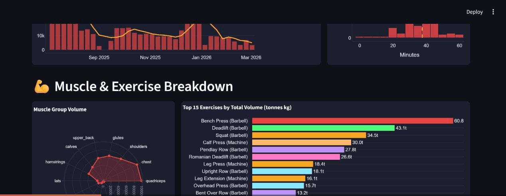

# 🏋️ Hevy Workout Dashboard

An interactive analytics dashboard for your [Hevy](https://hevy.com) workout data, built with Streamlit and Plotly.

[](https://p6ubhwvednjzqlfyiwmw72.streamlit.app/)



---

## Features

| Section | What you get |
|---|---|
| **Stats Overview** | Total workouts, volume lifted, avg session duration, longest streak, sets/session, unique exercises |
| **Training Activity** | GitHub-style workout calendar heatmap + day-of-week breakdown |
| **Volume & Session Trends** | Weekly volume bar chart with 4-week rolling average + session duration histogram |
| **Muscle & Exercise Breakdown** | Radar chart of volume by muscle group + top 15 exercises by total volume |
| **Exercise Progression & PRs** | Per-exercise weight progression chart with PR markers and PR history cards |
| **Estimated 1RM — Big 5** | Epley, Brzycki, and Lander formula estimates for Bench, Squat, Deadlift, OHP, and Pendlay Row |
| **Workout Types & Session Stats** | Workout frequency by type, sets-per-session distribution, exercises-per-session trend |
| **Monthly Progress & Balance** | Monthly volume + session count + Push / Pull / Legs balance donut |

**Sidebar controls:** toggle between kg / lbs, refresh data on demand, or paste a different API key.

---

## Getting Started

### 1. Get your Hevy API key

You need a **Hevy Pro** subscription. Go to [hevy.com/settings?developer](https://hevy.com/settings?developer) to generate your key.

### 2. Clone & install

```bash
git clone https://github.com/mathemisbo/hevy_dashboard.git
cd hevy_dashboard
pip install -r requirements.txt
```

### 3. Add your API key

Create `.streamlit/secrets.toml`:

```toml
HEVY_API_KEY = "your-api-key-here"
```

Or set the environment variable:

```bash
export HEVY_API_KEY="your-api-key-here"
```

Or just paste it into the sidebar when the app opens.

### 4. Run

```bash
streamlit run app.py
```

Open [http://localhost:8501](http://localhost:8501).

---

## Deploying to Streamlit Community Cloud

1. Push this repo to GitHub (private repo is supported)
2. Go to [share.streamlit.io](https://share.streamlit.io) → **New app**
3. Select your repo, branch `main`, file `app.py`
4. Under **Advanced settings → Secrets**, add:
   ```toml
   HEVY_API_KEY = "your-api-key-here"
   ```
5. Click **Deploy** — your dashboard will be live in ~60 seconds

---

## Project Structure

```
hevy_dashboard/
├── app.py                  # Streamlit dashboard
├── api.py                  # Hevy API client (with 1-hour local cache)
├── data.py                 # Transforms raw API data into DataFrames
├── requirements.txt
└── .streamlit/
    └── config.toml         # Dark theme configuration
```

---

## Tech Stack

- [Streamlit](https://streamlit.io) — app framework
- [Plotly](https://plotly.com/python/) — interactive charts
- [Pandas](https://pandas.pydata.org) — data wrangling
- [Hevy API](https://api.hevyapp.com/docs/) — workout data source
